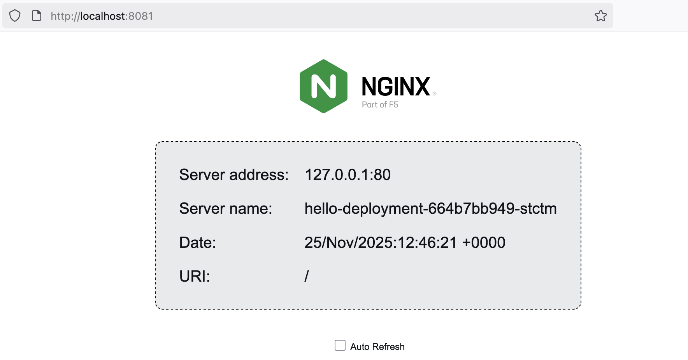

# minikube / kind / k3d for Local Kubernetes Development

## Introduction
AsciiArtify is an ML product for converting images into ASCII art.
Infrastructure requirements at the PoC stage:

- fast local deployment of Kubernetes clusters for development and testing;
- scalability (at least at the level of several nodes/replicas);
- easy onboarding for developers without deep DevOps experience;
- minimal licensing risks (Docker Desktop vs open alternatives);
- the ability to further transfer the approach to CI/CD.

## Features

### 1. minikube - https://minikube.sigs.k8s.io/docs/

A Kubernetes distribution that runs a single-node cluster inside a VM or container.

- **Supported OSes**: Linux, macOS, Windows
- **Automation capabilities**: CLI-based automation, supports multiple cluster profiles
- **Additional features**: built-in Dashboard UI, metrics server, and addons (like ingress, storage, etc.)
- **Maintainer**: Kubernetes SIGs
- **Installation**: Easy (supports VirtualBox, Docker, KVM, etc.)
- **Ideal for**: Local development, quick testing

**Pros**:
- Official Kubernetes project
- Many built-in addons
- Supports container runtimes
**Cons**:
- Can be heavier when using VM drivers
- Needs virtualization or Docker installed


```bash
# Download Minikube (Linux example)
curl -LO https://storage.googleapis.com/minikube/releases/latest/minikube-linux-amd64
sudo install minikube-linux-amd64 /usr/local/bin/minikube

# Start a cluster using Docker as driver
minikube start --driver=docker

# Verify
kubectl get nodes
```

### 2. kind - https://kind.sigs.k8s.io/
Run Kubernetes clusters in Docker containers — ideal for testing Kubernetes itself.
initially created for testing Kubernetes itself, widely used for CI and development
- **Supported OSes**: Linux, macOS, Windows.
- **Automation capabilities**: 
    - Highly extensible CLI workflow
    - YAML-based cluster config for automation
    - Designed for CI/CD environments — rapid ephemeral cluster creation.
- **Additional features**: 
    - Uses standard Kubernetes tools (Helm, metrics-server, dashboard installed manually)
    - No built-in addons.
- **Maintainer**: Kubernetes SIGs
- **Installation**: Simple CLI tool
- **Ideal for**: Kubernetes testing, CI environments
**Pros**:
- Lightweight and fast
- Designed for Kubernetes development
- Good Podman support, allowing Docker Desktop avoidance.
**Cons**:
- Networking can be tricky. Accessing services from the host often requires NodePort or port-forwarding.
- Not suitable for persistent workloads

```bash
# Install kind
curl -Lo ./kind https://kind.sigs.k8s.io/dl/latest/kind-linux-amd64
chmod +x ./kind
sudo mv ./kind /usr/local/bin/kind

# Create a cluster
kind create cluster

# Verify
kubectl get nodes
```

### 3. k3d - https://k3d.io/

A wrapper to run k3s clusters inside Docker containers.
- **Supported OSes**: Linux, macOS, Windows.
- **Automation capabilities**: 
    - Very simple CLI
    - Easy scripting for multi-node clusters.
- **Additional features**: 
    - Minimal built-in features (k3s is intentionally lightweight).
    - Supports load-balancer port mappings
    - Monitoring/dashboard installed manually via standard Kubernetes tooling.
- **Maintainer**: Community (k3d-io)
- **Installation**: Extremely fast setup
- **Ideal** for: Local dev, CI pipelines

**Pros**:
- Super fast cluster creation
- Clean Docker-based isolation
- Ideal for ephemeral environments

**Cons**:
- Not suitable for production
- Requires Docker installed

```bash
# Install k3d
curl -s https://raw.githubusercontent.com/k3d-io/k3d/main/install.sh | bash

# Create a cluster
k3d cluster create mycluster

# Verify
kubectl get nodes
```

## Pros and Cons, comparison table


## Docker Desktop Licensing

Docker Desktop is free for:

- personal use
- education
- non-commercial open-source
- small businesses (<250 employees and < $10M annual revenue)

For larger organizations, a paid subscription is required.

For AsciiArtify (as a small startup), Docker Desktop is safe to use, but:

- future growth may require a paid plan;
- some enterprise environments forbid Docker Desktop entirely.

### Podman as a Free Alternative

Pros of Podman:

- Rootless by default, daemonless — more secure.
- CLI-compatible with Docker (alias docker=podman).
- No licensing concerns.

Compatibility with cluster tools:

- minikube — official Podman driver available; recommended with CRI-O on Linux.
- kind — good Podman support via Docker API compatibility.
- k3d — Podman support exists but is still experimental.


## Conclusions
For POC and local development, **k3d** is recommended due to its speed, simplicity, and Docker-based isolation. It allows rapid cluster creation and is ideal for ephemeral environments.

## Demo
Link to recording: [demo.cast](https://asciinema.org/a/hmnM1IPz7nXMAewiql4ykWWJw)


Deployed app:



Resources: 
- https://medium.com/@emircanagac/comparing-minikube-k3s-k3d-microk8s-and-more-lightweight-kubernetes-for-local-development-929585ba9503
- https://minikube.sigs.k8s.io/docs/start/
- https://kind.sigs.k8s.io/docs/user/quick-start/
- https://docs.k3s.io/installation/requirements

